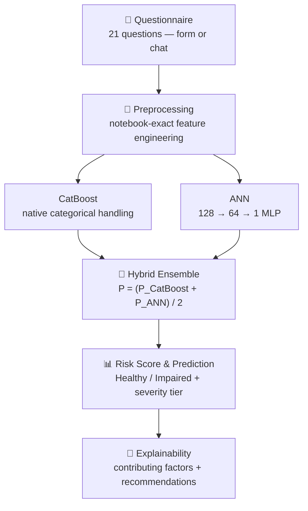

<div align="center">

# 🧠 Neuro-Screen

**A Hybrid Ensemble Framework for Early Detection of Cognitive Impairment in Insomniac University Students**

Neuro-Screen turns a short, self-reported sleep and lifestyle questionnaire into a cognitive-impairment **risk screening** result. A trained CatBoost + ANN hybrid model scores the answers, then explains *why* — surfacing the contributing factors instead of just a number. It is a research prototype, **not** a clinical diagnostic tool.

[](https://www.python.org/)
[](https://streamlit.io/)
[](https://catboost.ai/)
[](https://pytorch.org/)
[](#-disclaimer)
[](#-license)

</div>

---

## 📌 At a Glance

| Category  | Details |
|---|---|
| Project | Neuro-Screen |
| Domain | AI / Machine Learning · Cognitive-impairment screening |
| Framework | Streamlit (native multipage app) |
| Models | CatBoost (gradient boosting) + ANN (PyTorch MLP), blended |
| Dataset | 2,237 self-reported surveys, university students aged 20–35, Bangladesh |
| Features | 21 model input features (22 raw survey columns) |
| Task | Binary risk classification — Healthy vs. Impaired |
| Status | Research prototype · undergraduate thesis (AIUB, Group G52) |

> No public deployment is currently live for this app — see [Local Setup](#-local-setup) to run it yourself.

---

## 💡 Why Neuro-Screen?

Sleep disruption and insomnia are common among university students, and their link to reduced cognitive performance — memory lapses, poor concentration, slower decision-making — is well documented but rarely screened for in an academic setting.

Neuro-Screen explores whether a short self-reported questionnaire about sleep and lifestyle habits can be used to flag patterns associated with cognitive-impairment risk, using a trained ML pipeline instead of a rule-of-thumb score — so at-risk students could be pointed toward academic and psychological support earlier.

> **Screening ≠ diagnosis.** Neuro-Screen estimates risk from self-reported answers on an academic dataset. It has not been clinically validated and must never replace a professional medical assessment.

---

## ⚙️ How It Works



Both the quick check-in form (**Assessment**) and the **Assistant** chat collect the same 21 answers and call the exact same inference function — there is no separate mock or randomized scoring path.

---

## 🧬 Model Architecture

**CatBoost** — a gradient-boosted tree ensemble trained directly on the native categorical survey responses (no one-hot encoding), chosen for handling categorical, non-linear feature interactions well.

**ANN** — a 3-layer MLP (128 → 64 → 1, ReLU hidden / Sigmoid output, dropout 0.6/0.4) trained on a one-hot encoded, standard-scaled version of the same features, as a complementary feature extractor.

**Hybrid Ensemble** — the two models' probabilities are blended by simple arithmetic mean and thresholded at 0.5:

```
P_hybrid = (P_CatBoost + P_ANN) / 2
prediction = "Impaired" if P_hybrid >= 0.5 else "Healthy"
```

The target label (`cognitive_impairment`) is derived from seven self-reported cognitive-symptom questions (mental stamina, spacing out, audio lag, forgetfulness, reminder reliance, brain fog, decision-making), summed into a cumulative score and binarized at its 72nd percentile.

---

## 🗂️ Dataset

| Property | Value |
|---|---:|
| Responses | 2,237 |
| Raw columns | 22 |
| Model features | 21 |
| Training rows | 1,790 |
| Test rows | 447 |
| Split | 80/20 stratified, seed 42 |
| Population | University students, Bangladesh, ages 20–35 |
| Self-reported insomniac | ~75.7% |
| Labeled impaired (target) | ~37.1% |

Missing values are kept as a genuine `"Missing"` category rather than imputed, since CatBoost handles categorical missingness natively.

---

## 📈 Model Performance

Reported numbers from the Neuro-Screen conference paper (ICCA 2026) and thesis report, evaluated on the held-out test split (n = 447):

| Model | Accuracy | Precision | Recall | F1-Score | ROC-AUC |
|---|---:|---:|---:|---:|---:|
| CatBoost | 94.12% | 93.80% | 95.00% | 94.39% | 0.9780 |
| ANN | 91.25% | 89.50% | 92.00% | 90.73% | 0.9450 |
| **Hybrid (Neuro-Screen)** | **95.20%** | **94.40%** | **96.10%** | **95.24%** | **0.9820** |

**Confusion matrix (Hybrid, n = 447):** TN 212 · FP 12 · FN 9 · TP 214

> These are reported research/test-set results, not a clinical validation study. The app's **Explainability** page also reproduces metrics live from the currently trained artifacts and labels them separately as *Live (trained)*, so they're never confused with the officially published *Reported (paper)* numbers.

---

## 🔬 Explainability

After a prediction, the **Results** and **Explainability** pages show:

- Risk score, severity tier, and Healthy/Impaired prediction
- Per-model probability breakdown (CatBoost / ANN / Hybrid)
- The top contributing factors behind that specific prediction
- Practical, factor-driven recommendations
- The paper-reported confusion matrix, ROC curve, and feature-importance chart for context

---

## 💬 AI Assistant

The **Assistant** page is a chat interface that collects the same 21 answers conversationally instead of via a form, then runs the identical inference pipeline used by the Assessment page.

Replies are matched loosely against each question's allowed options (numbers, ranges, "less than"/"more than" phrasing, number words, common aliases, and free text for the university field) so users can answer naturally — e.g. "around 5 hours" or "i'm male" — instead of typing exact predefined values. Genuinely unclear answers get a short clarification prompt. It also includes a crisis-language safety redirect. It is a guided questionnaire assistant, not a general-purpose medical AI.

---

## 🛠️ Tech Stack

| Layer | Technology |
|---|---|
| Language | Python 3.11 |
| UI / App framework | Streamlit (native multipage routing) |
| ML — gradient boosting | CatBoost |
| ML — neural network | PyTorch |
| Preprocessing / evaluation | scikit-learn |
| Data handling | Pandas, NumPy |
| Visualization | Plotly (risk meter, confusion matrix, ROC curve, feature importance) |

---

## 📁 Project Structure

```text
neuro-screen-streamlit/
├── app.py                       # page shell, theme, native multipage router
├── config.py                    # paths, brand identity, risk thresholds, JSON helpers
├── data/
│   ├── Thesis Dataset.csv       # raw survey dataset
│   ├── feature_schema.json      # UI → model-column mapping (21 features)
│   └── reported_results.json    # official paper-reported numbers
├── models/                      # trained artifacts (CatBoost, ANN, scaler, encoders, metrics)
├── modules/
│   ├── core/
│   │   ├── preprocessing.py     # notebook-exact feature engineering
│   │   ├── risk.py              # severity tiers, contributing factors, recommendations
│   │   └── model_defs.py        # ANN architecture definition
│   ├── predictor.py             # the single inference path (CatBoost + ANN hybrid)
│   ├── chat/assistant.py        # conversational check-in (same inference pipeline)
│   ├── charts/charts.py         # Plotly figures (confusion matrix, ROC, importances)
│   └── ui/pages/                # Home, Assessment, Results, Explainability, Assistant
├── scripts/
│   ├── train_models.py          # reproduces the thesis notebook pipeline, exports artifacts
│   └── verify_predictions.py    # checks dashboard vs. notebook prediction parity
├── assets/                      # logo, stylesheet
└── requirements.txt
```

---

## 🚀 Local Setup

```bash
git clone https://github.com/Saji-d/neuro-screen.git
cd neuro-screen

python -m venv .venv
```

**Windows:**
```powershell
.venv\Scripts\Activate.ps1
```

**macOS / Linux:**
```bash
source .venv/bin/activate
```

**Install dependencies and run:**
```bash
pip install -r requirements.txt
streamlit run app.py
```

Trained model artifacts already ship in `models/`, so predictions work out of the box. To retrain from scratch:

```bash
python scripts/train_models.py
python scripts/verify_predictions.py   # sanity-checks dashboard vs. notebook parity
```

---

## 🎓 Research Context

**American International University-Bangladesh (AIUB)**
Faculty of Science and Technology · Department of Computer Science
**CSC 4298 — Thesis/Project** · Spring 2025–2026

---

## 👥 Team

**Thesis Group G52**

| Author | Student ID |
|---|---|
| **Sajidur Rahman Sajid** — Lead developer | 22-49076-3 |
| Khadija Akter | 22-48295-3 |
| Md Iqramul Kabir | 22-46165-1 |
| Shahadat Hossain Gazi | 22-48095-2 |

---

## ⚠️ Disclaimer

> **Neuro-Screen is a research prototype for academic exploration and screening support. It is not a clinical diagnostic tool and should not replace professional medical evaluation.**

---

## 📄 License

No open-source license has been published for this repository yet. All rights reserved by the authors unless stated otherwise.
